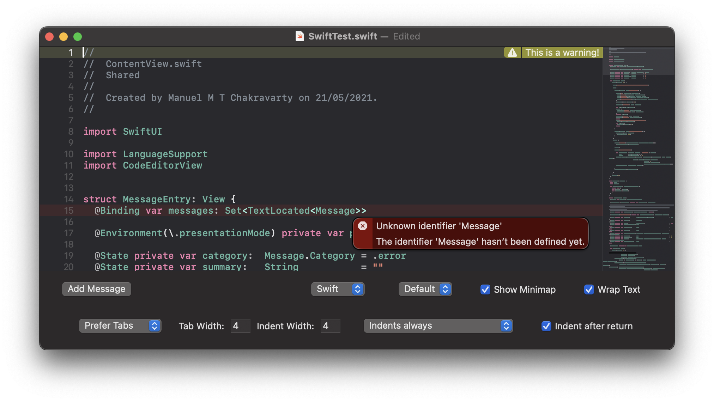
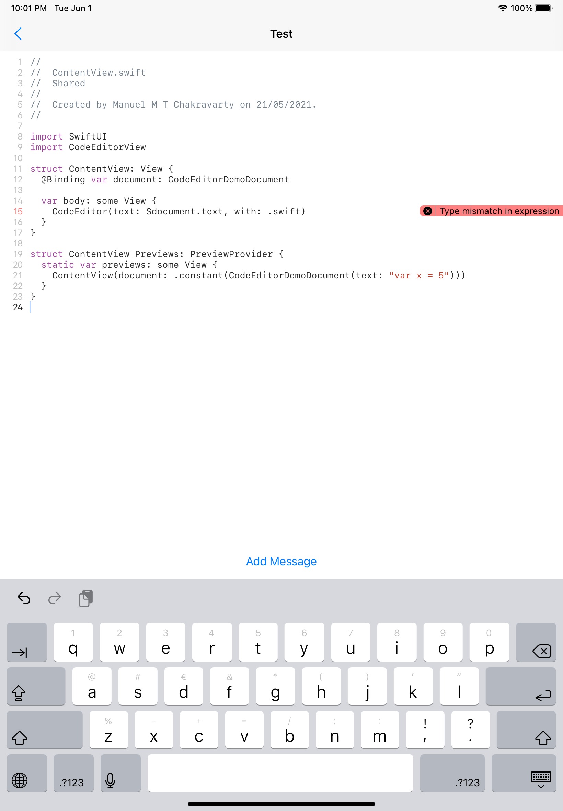

# SwiftUI code editor view for iOS, visionOS, and macOS

[](https://swiftpackageindex.com/mchakravarty/CodeEditorView)
[](https://swiftpackageindex.com/mchakravarty/CodeEditorView)

The `CodeEditorView` Swift package provides a SwiftUI view implementing a rich code editor for iOS, visionOS, and macOS whose visual style is inspired by Xcode. The currently supported functionality includes syntax highlighting with configurable themes, inline message (warnings, errors, etc) reporting, bracket matching, matching bracket insertion, current line highlighting, and a minimap.

**Update:**

* `CodeEditorView` is now based on TextKit 2.
* The TextKit 2 implementation requires the latest versions of macOS (14) and iOS (17). If you want to use `CodeEditorView` on earlier version of macOS or iOS, you need to use release 0.12.0 or the `textkit1` branch of this repository. (I don't have the bandwidth to support TextKit 2 on earlier OS versions, but I am happy to accept PRs that add support for it. They need to use Swift 5.9, though.)
* On macOS, `CodeEditorView` also supports (1) displaying information about identifiers (such as type information and documentation provided in Markdown) as well as (2) code completion. This will eventually also be supported on iOS.

## Screenshots of the demo app

This is the default dark theme on macOS. Like in Xcode, messages have got an inline view on the right-hand side of the screen, which pops up into a larger overlay to display more information. The minimap on the right provides an outline of the edited text.



The following is the default light theme on iOS. 




## How to use it

Typical usage of the view is as follows.

```swift
struct ContentView: View {
  @State private var text:     String                    = "My awesome code..."
  @State private var position: CodeEditor.Position       = CodeEditor.Position()
  @State private var messages: Set<TextLocated<Message>> = Set()

  @Environment(\.colorScheme) private var colorScheme: ColorScheme

  var body: some View {
    CodeEditor(text: $text, position: $position, messages: $messages, language: .swift)
      .environment(\.codeEditorTheme,
                   colorScheme == .dark ? Theme.defaultDark : Theme.defaultLight)
  }
}
```


## Demo app

To see the `CodeEditorView` in action, have a look at the repo with a [cross-platform demo app](https://github.com/mchakravarty/CodeEditorDemo).


## Documentation

For more information, see the [package documentation](Documentation/Overview.md).


## Status

I consider this to be pre-release quality. It is sufficient to build something with it, but it is not yet ready for production. The `CodeEditor` view already supports quite a bit of advanced functionality (such as the inline messages, a minimap, and (on macOS) code completion). Other components are still quite simple, such as the range of tokens covered by the language configuration, but that is also something that is easily extended. Performance is still an issue for larger files.

## License

Copyright [2021..2024] Manuel M. T. Chakravarty. 

Distributed under the Apache-2.0 license — see the [license file](LICENSE) for details.
